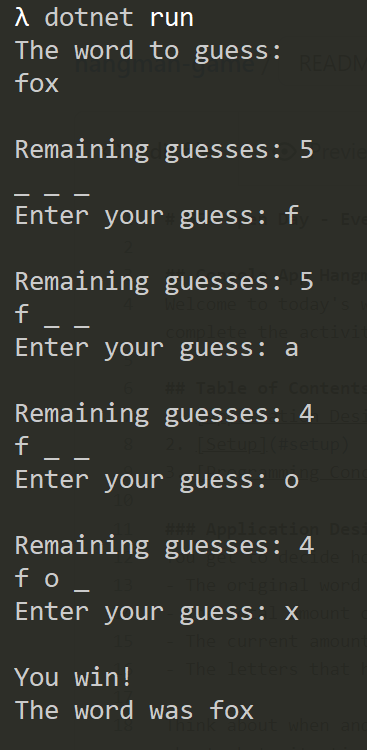

# GFA Open Day - Third Workshop

## Console App - Guess The Word
Welcome to today's workshop where you will learn how to create your own word guessing game that you can play in a terminal! We will use C# and Visual Studio Code to complete the activity.

## Table of Contents
1. [Application Design](#application-design)
   - [Basic version](#basic-version)
   - [Advanced version](#advanced-version)
3. [Setup](#setup)
4. [Programming Concepts](#programming-concepts)

### Application Design
You get to decide how to structure and write your own application, but here are some ideas on what pieces of information to keep track of:
- The original word to guess
- The total amount of wrong guesses allowed
- The current amount of wrong guesses
- The letters that have been guessed correctly

Think about when and where you want to update these pieces of code. A mentor can help you with designing the flow of your program if you'd like. Also think about what situations will cause the player to lose the game, and which ones will cause them to win.

You will also need to include messages to tell the user what to do and show the result of the game. Here's an example of how a finished game might look in the terminal:



#### Basic Version
If you are newer to programming, use the [basic version template](./basic/Program.cs). It includes helper methods you can use so that you can focus only on writing the logical flow of the application without having to learn more advanced C# syntax. Read through the [Methods](#methods) section before starting.

#### Advanced Version
If you already have some programming experience, try the [advanced version](./advanced/Program.cs). There are no helper methods included, so you have to write all the logic on your own. Familiarize yourself with [for-loops](https://docs.microsoft.com/en-us/dotnet/csharp/language-reference/statements/iteration-statements#the-for-statement) and [string manipulation](https://www.programiz.com/csharp-programming/string) if you are not already.

### Setup
Before you can get started, you will need to download & install the following software on your computer:
- [Visual Studio Code](https://code.visualstudio.com/download)
- [.NET SDK 6.0.301](https://dotnet.microsoft.com/en-us/download/dotnet/6.0)
- [C# Extension for VS Code](https://marketplace.visualstudio.com/items?itemName=ms-dotnettools.csharp)

Then you will need to [create a C# Console App in VS Code](https://docs.microsoft.com/en-us/dotnet/core/tutorials/with-visual-studio-code?pivots=dotnet-6-0#create-the-app).

If you need help with any of these steps, please let a mentor know!

### Programming Concepts
Since C# is an object-oriented programming (OOP) language, the mentor will introduce you to some basic OOP concepts & syntax to help you write your code:
- [Reading from and writing to the Console](#reading-from-and-writing-to-the-console)
- [Variables](#variables)
- [Operators  and expressions](#operators-and-expressions)
- [Methods](#methods)

#### Reading from and Writing to the Console
When you want to display some information in the terminal window, you can use the `Console.WriteLine()` method. Inside the parentheses, you need to give it either a string (which is characters contained inside double quotation marks "") or a number:
```csharp
Console.WriteLine("Hello world!");
Console.WriteLine(203);
```

Try it out in VS Code! You can copy the lines above or type them yourself into Program.cs. When you are ready to test it, open the built-in terminal inside of VS Code and type the command `dotnet run` and hit enter. If you don't see anything in the terminal, ask a mentor to help you.

If you want your application to accept input from the user, you can use the `Console.ReadLine()` method. You need to assign the input to a variable to work with the data in your code, like this:

```csharp
string input = Console.ReadLine();
```

You will learn more about variables in the next section.

#### Variables
Variables store information that we want to reference and manipulate in our code. They allow us to save important information in 1 place that we can refer to in other parts of our code, so that we don't have to type the same information over and over. Here's an example:
```csharp
string name = "Freddy Fox";
Console.WriteLine(name);
```
When making a variable, you need to include **3** pieces of information: the type (here it is `string`), the alias (in the example above it's `name`) and the value you want to assign to it (`"Freddy Fox"` in our case). If you don't want to specifically say what the type is, you can use `var` and C# will figure it out for you.

You should see `Freddy Fox` in your terminal after running this code. If you want to change the name later, you only need to change the first line since the second line refers to the variable and not a hardcoded string.

Today's workshop will primarily work with strings, but it's a good idea to know some other basic types as well. The most commom ones are `int`, short for integer (whole numbers), and `char`, short for character (one symbol). Strings are usually made of 2 or more `chars`, but a single character could be either a `string` or a `char`, depending on how you want to use it.

#### Operators and Expressions
Operators are symbols that allow you to do many kinds of comparisons and manipulations of values. C# has [five categories](https://docs.microsoft.com/en-us/dotnet/csharp/language-reference/operators/) of operators, but the most important ones for this workshop are [arithmetic](https://docs.microsoft.com/en-us/dotnet/csharp/language-reference/operators/arithmetic-operators), [comparison](https://docs.microsoft.com/en-us/dotnet/csharp/language-reference/operators/comparison-operators), and [equality](https://docs.microsoft.com/en-us/dotnet/csharp/language-reference/operators/equality-operators) operators. If you'd like to do the advanced version also look at [boolean logical operators](https://docs.microsoft.com/en-us/dotnet/csharp/language-reference/operators/boolean-logical-operators).

##### Arithmetic Operators
The 2 relevant operators for today's workshop are `++` increment and `+` addition (which everyone should be familiar with). The increment operator `++` will increase the value of the variable it's applied to by 1, like this:

```csharp
int number = 15;
number++;
Console.WriteLine(number);
```

The value in the terminal should be 16. If not, check with a mentor to see what's wrong.

There are 2 ways you can increase the value of a variable by 1:

```csharp
number++;
number = number + 1;
```

You can also use the `+` operator to combine multiple strings and variables into 1 string like this:

```csharp
int age = 27;
string name = "Lucie";
Console.WriteLine("My name is " + name + " and I am " + age + " years old.");
// The output should look like "My name is Lucie and I am 27 years old."
```

##### Comparison Operators
Comparison operators should also feel familiar, as you probably learned about the concepts in elementary school. There are 4 in total: `<` less than, `>` greater than, `<=` less than or equal to, and `>=` greater than or equal to. When you use these operators to compare 2 numbers, you create what's called a **boolean expression**. That means the result of the expression will be of the type `bool` (boolean). Boolean type results can only have the value of `true` or `false`. Try this code below in VS Code:

```csharp
Console.WriteLine(10 <= 6);
```

You should see `false` in your terminal. If not, please ask a mentor for help.

##### Equality Operators
There are only 2 equality operators: `==` equal to and `!=` not equal to. These also create boolean expressions, but you are not limited to just numbers. You can use these to compare strings as well. Try this code below in VS Code:

```csharp
Console.WriteLine("fox" == "fox");
```

##### If-Else Statements
Now that you know a little about operators and boolean expressions, you can start writing if-else statements. If statements are a type of conditional statement where if the result is `true`, a designated block of code will run. Look at the example below:

```csharp
int a = 4;
int b = 7;

if (a < b)
{
    Console.WriteLine(a + " is less than " + b);
}
```

If the expression `a < b` is `true`, the block of code will execute. But if it's `false`, nothing will happen. If you'd like something to happen when the value is `false`, you can include an else statement as well, like this:

```csharp
if (a < b)
{
    Console.WriteLine(a + " is less than " + b);
}
else
{
    Console.WriteLine(b + " is less than " + a);
}
```

#### Methods
Think of methods as a way to conveniently package blocks of code so that you can reuse it anywhere in your application. Let's take a look at the anatomy of methods first:

```csharp
bool IsLessThan(int a, int b)
{
    return a < b;
}
```

The top line is called the **method signature**, and it contains 3 parts: the return type, the name, and the input parameters. This method returns a boolean value, but methods can return many different types, including `string`, `int`, or even `void` if you want to return nothing. The name is "IsLessThan," and in order for your code to run you need to give it 2 integer numbers to work with. Since this method doesn't return `void`, we will want to assign the output to a variable to use later in our code. Look at this example below:

```csharp
int numberA = 100;
int numberB = 200;

bool isALessThanB = IsLessThan(numberA, numberB);

if (isALessThanB)
{
    Console.WriteLine("A is less than B");
}
else
{
    Console.WriteLine("B is less than A");
}
```

Since we assigned the output of the method to a variable, we were able to refer to the value in our if statement. If we change the values of numberA and numberB, the rest of the code will still run correctly. Try it out in VS Code, and if you have any questions please ask a mentor.
